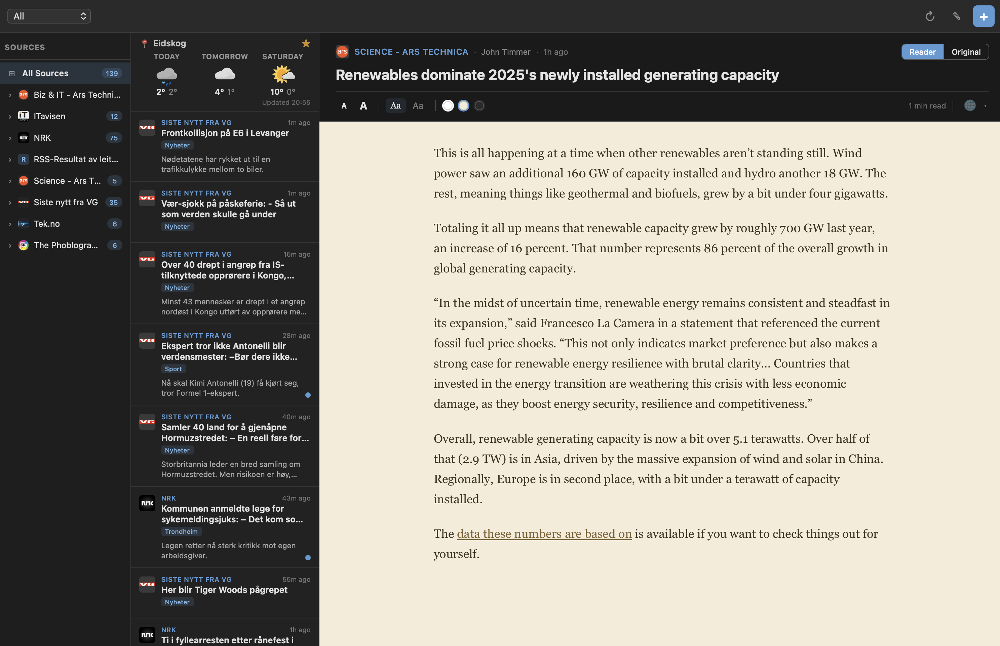

<p align="center">
  
</p>

<h1 align="center">Downlink</h1>

<p align="center">
  A lightweight, native desktop RSS reader built with <a href="https://tauri.app/">Tauri 2</a>, <a href="https://kit.svelte.dev/">SvelteKit</a>, and Rust.
</p>

<p align="center">
  
</p>

---

Downlink lets you subscribe to RSS and Atom feeds, read articles in a clean reader mode or their original format, translate content into 28 languages, and keep a compact weather forecast in your sidebar — all from a single, fast desktop app with a tiny footprint.

## Highlights

- **Native & fast** — Tauri 2 backend with Rust; small binary, low memory usage.
- **Three-panel layout** — sources on the left, article list in the middle, reading pane on the right. Both sidebar widths are resizable and remembered across sessions.
- **Dark mode** — follows the system color scheme automatically, or can be set to always-light or always-dark.
- **Cross-platform** — builds for macOS, Windows, and Linux.

---

## Features

### Feed Management

- **RSS & Atom support** — subscribe to any standard feed URL.
- **Automatic feed discovery** — paste a website URL and Downlink will find the feed for you by inspecting `<link>` tags and probing common paths like `/feed`, `/rss.xml`, `/atom.xml`, and more.
- **OPML import & export** — migrate subscriptions to and from other readers with full OPML 2.0 support, including categories.
- **Tag organization** — categorize feeds with tags (Tech, News, Science, Gaming, Finance, Sports, Entertainment, Programming, Photography) and filter the article list by tag.
- **Category badges** — article categories from the feed itself are displayed as badges on each card and as expandable subcategories in the sidebar.
- **Feed health indicators** — a warning icon appears next to feeds that are failing to fetch, with the error message and a one-click retry button.
- **Unread count badges** — per-feed and per-category unread counts are shown throughout the sidebar.

### Reading Experience

- **Reader mode** — extracts article content using [Mozilla Readability](https://github.com/mozilla/readability) with extensive preprocessing: lazy-load image rescue, relative URL resolution, and dimension-aware sizing. Content is sanitized by stripping 30+ selector patterns for ads, navigation, popups, cookie banners, social sharing widgets, tracking pixels, and more.
- **Original view** — view articles in a native webview with cosmetic ad-blocking (CSS element hiding and a MutationObserver that removes injected ad nodes).
- **Open in browser** — optionally open articles directly in your default system browser.
- **Configurable default view** — choose whether articles open in Reader, Original, or Browser mode by default.
- **Read / unread tracking** — articles are marked as read when opened; read state is preserved across feed refreshes and never accidentally reset.
- **Context menu** — right-click any article card for quick actions: open in browser, mark as read/unread, or copy the link.

### Reader Mode Customization

| Option | Choices |
| ------ | ------- |
| **Theme** | Light, Sepia, Dark |
| **Font** | Serif (Georgia / Charter / Palatino), Sans-serif (system font stack) |
| **Size** | Five steps: 14 px, 16 px, 18 px, 20 px, 22 px |

- **Reading progress bar** — a thin bar at the top of the reader tracks your scroll position in real time.
- **Estimated reading time** — calculated at ~238 words per minute and displayed in the toolbar.
- **Image lightbox** — click any image to view it full-size in an overlay. Downlink automatically attempts to find the highest-resolution version through srcset parsing, parent link inspection, and URL heuristics for WordPress, Photon, Medium, Cloudinary, and Substack CDNs.
- **Smart image classification** — images are automatically sized based on their dimensions: tiny images (icons, emojis) stay inline, small images center at their natural width, and large images scale responsively.
- **Style hot-swapping** — changing theme, font, or size applies instantly without reloading the page, preserving your scroll position.

### Built-in Translation

- **28 supported languages** — translate any article via the free Google Translate API, routed through the Rust backend to avoid CORS issues.
- **Structure-preserving** — translation operates on block-level HTML elements (paragraphs, headings, list items, blockquotes, table cells), keeping the article layout intact.
- **Automatic batching** — text is chunked into ≤4,500-character batches to respect API limits.
- **One-click toggle** — a toolbar button switches between the original and translated content; changing the target language auto-re-translates without re-fetching.

### Weather Widget

- **3-day forecast** — compact widget at the top of the article list powered by [MET Norway](https://api.met.no/) (`locationforecast/2.0`), with official weather icons.
- **Location search** — find any location by name via [Nominatim](https://nominatim.openstreetmap.org/) geocoding with instant search-as-you-type and debounce.
- **Favorite locations** — save and quickly switch between locations; favorites persist across sessions.
- **Temperature units** — toggle between Celsius and Fahrenheit in settings.
- **yr.no integration** — click the forecast to open the full forecast on [yr.no](https://www.yr.no/) for the selected location.
- **Synced refresh** — weather updates automatically when feeds refresh.

### Desktop Integration

- **System tray** — minimize to the tray instead of quitting. The tray icon shows unread counts (macOS) and provides a context menu for refreshing feeds or restoring the window.
- **Background refresh** — feeds continue to refresh on schedule even when the window is hidden.
- **Configurable refresh interval** — choose from 15 minutes, 30 minutes, 1 hour, 2 hours, 4 hours, 12 hours, or 24 hours.
- **Article retention** — automatically prune old articles after 24 hours, 48 hours, 1 week, 2 weeks, or keep them forever.
- **Automatic OPML backups** — schedule daily, weekly, or monthly backups to a directory of your choice, with configurable time-of-day.
- **Window geometry persistence** — remembers your window position, size, and panel widths across sessions.
- **Start minimized** — optionally launch straight to the system tray.
- **Native menu bar** — File menu with Settings, Import/Export, and About; Edit menu with standard shortcuts; Help menu with keyboard shortcut reference.

### Keyboard Shortcuts

| Key | Action |
| --- | ------ |
| `W` | Previous article |
| `S` | Next article |
| `↑` / `↓` | Scroll article content |
| `Q` / `Escape` | Close article / close modal |
| `⌘N` / `Ctrl+N` | Add new feed |

### Performance

- **Virtual scrolling** — the article list uses a custom virtual scroll implementation with binary-search positioning and a ResizeObserver for pixel-accurate layout, keeping thousands of articles smooth.
- **Parallel fetching** — all feeds are refreshed concurrently with `Promise.allSettled`.
- **SQLite persistence** — feeds, articles, and settings are stored in a local SQLite database; read state is preserved through an upsert that never un-reads an article.
- **Lazy image preprocessing** — nine `data-*` attributes and three `srcset` variants are promoted to real sources before Readability runs, so lazy-loaded images aren't lost.

---

## Tech Stack

| Layer | Technology |
| -------- | ------------------------------------------- |
| Backend | Rust, Tauri 2, reqwest, feed-rs, SQLite |
| Frontend | SvelteKit (Svelte 5 runes), TypeScript, Vite |
| Reader | Mozilla Readability, custom HTML renderer |
| Weather | MET Norway API, Nominatim (OpenStreetMap) |
| Translation | Google Translate API (via Rust backend) |

---

## Prerequisites

- [Node.js](https://nodejs.org/) (v18+)
- [Rust](https://www.rust-lang.org/tools/install) (stable)
- Tauri 2 CLI and system dependencies — see the [Tauri prerequisites guide](https://v2.tauri.app/start/prerequisites/)

## Getting Started

```sh
# Clone the repository
git clone https://github.com/cgxeiji/downlink.git
cd downlink

# Install frontend dependencies
npm install

# Run in development mode (starts both Vite dev server and Tauri)
npm run tauri dev
```

## Building

```sh
# Create a production build
npm run tauri build
```

The bundled application will be output to `src-tauri/target/release/bundle/`.

---

## Project Structure

```
downlink/
├── src/                        # SvelteKit frontend
│   ├── lib/
│   │   ├── components/         # Svelte components
│   │   │   ├── AddFeedModal.svelte
│   │   │   ├── ArticleCard.svelte
│   │   │   ├── ArticleView.svelte
│   │   │   ├── ManageFeedsModal.svelte
│   │   │   ├── SettingsModal.svelte
│   │   │   ├── VirtualArticleList.svelte
│   │   │   └── WeatherWidget.svelte
│   │   ├── services/           # Backend communication
│   │   │   ├── rss.ts          # Feed fetching & refresh logic
│   │   │   ├── weather.ts      # Weather & geocoding client
│   │   │   └── webview.ts      # Native webview management
│   │   ├── stores/             # Svelte stores (state management)
│   │   │   ├── feeds.ts        # Feed & article state
│   │   │   ├── reader.ts       # Reader mode settings
│   │   │   ├── ui.ts           # Refresh signals, timestamps
│   │   │   └── weather.ts      # Weather location & favorites
│   │   ├── types/              # TypeScript type definitions
│   │   └── utils/              # Helpers (content processing, dates, reader HTML)
│   └── routes/                 # SvelteKit routes & layout
├── src-tauri/                  # Tauri / Rust backend
│   ├── src/
│   │   ├── lib.rs              # Tauri commands & app setup
│   │   └── main.rs             # Entry point
│   ├── Cargo.toml
│   └── tauri.conf.json
├── static/                     # Static assets
└── package.json
```

---

## Settings Overview

Downlink ships with a comprehensive settings panel organized into five sections:

| Section | What you can configure |
| ------------ | ---------------------- |
| **Appearance** | Theme (System / Light / Dark), temperature units (°C / °F), compact list mode |
| **Articles** | Default view (Reader / Original / Browser), refresh interval, article retention period |
| **Window** | Close-to-tray, start minimized, restore window position, auto-refresh on launch |
| **Backup** | Scheduled OPML backups (frequency, time, directory), manual backup button |
| **Storage** | Database stats, clear article cache, clear all data |

---

## Known Notes

- **macOS Keychain prompt** — when running unsigned development builds on macOS, WKWebView's WebCrypto may trigger a Keychain access dialog ("webcrypto masterkey for downlink"). This is expected and harmless; signing the app (even ad-hoc) prevents the prompt.
- **Webview layering** — Tauri child webviews are native OS-level overlays that sit above the app DOM. Modals move webviews off-screen so dialogs remain accessible.

## Roadmap

For a full list of planned features, improvements, and ideas, see **[todo.md](todo.md)**.

## Contributing

Contributions are welcome! Here's how you can help:

1. **Fork** the repository and create a new branch from `main`.
2. **Make your changes** — whether it's a bug fix, new feature, or documentation improvement.
3. **Test locally** — make sure the app builds and runs cleanly:
   ```sh
   npm run check          # TypeScript / Svelte type checking
   cd src-tauri && cargo check  # Rust type checking
   npm run tauri dev      # Run the full app
   ```
4. **Open a pull request** with a clear description of what you changed and why.

### Ideas for Contributions

- **Cross-platform testing** — verify webview alignment, ad-blocking, and weather on Windows and Linux with various display scaling factors.
- **Accessibility** — ARIA attributes, focus management, and screen reader announcements.
- **Enhanced ad-blocking** — expand CSS selector lists or explore platform-native request blocking (e.g., WKWebView content rules on macOS).
- **Reader improvements** — code block syntax highlighting, offline caching, scroll position memory.
- **Tests** — unit and integration tests for the feed parsing pipeline, store logic, and weather services.

### Guidelines

- Keep pull requests focused — one feature or fix per PR.
- Match the existing code style (Prettier for the frontend, `rustfmt` for Rust).
- If you're adding a new dependency, mention why it's needed in the PR description.
- For larger changes, consider opening an issue first to discuss the approach.

## License

This project is licensed under the [GNU General Public License v3.0](LICENSE).